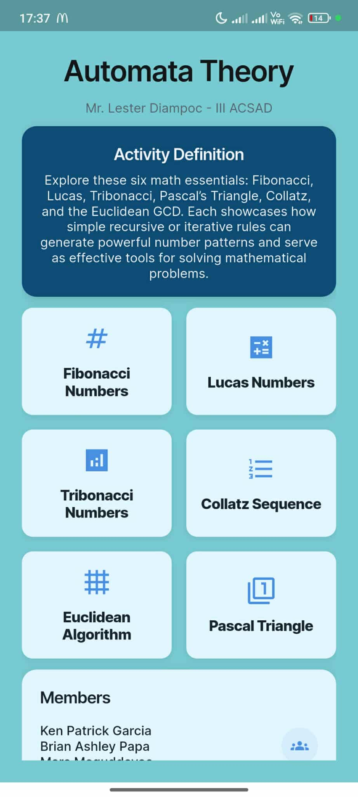
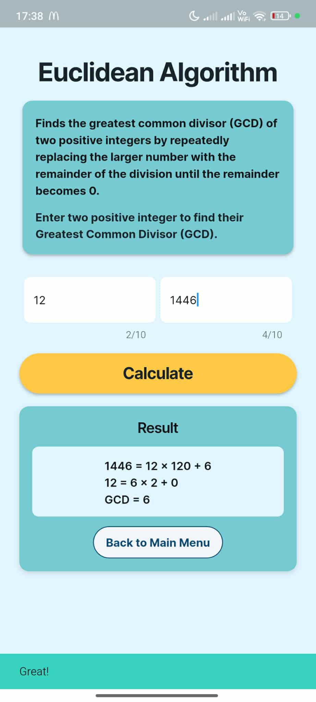
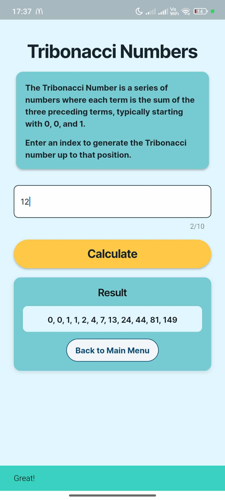
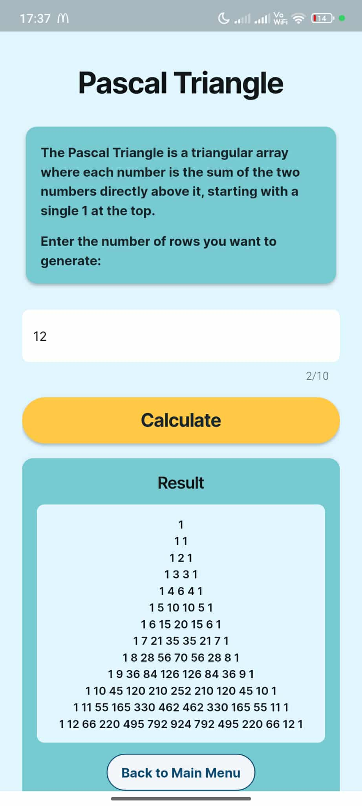

# 🔢 SeqSense

A Flutter application for visualizing and experimenting with popular number sequences and mathematical algorithms. Originally scaffolded with FlutterFlow and fully customized in Dart, **SeqSense** offers an intuitive UI for exploring:

- **Fibonacci Sequence:** Each term is the sum of the two preceding terms, starting with 0 and 1.
- **Lucas Numbers:** Similar to Fibonacci but begins with 2 and 1, generating a unique series with the same recurrence.
- **Tribonacci Sequence:** Extends the Fibonacci concept; each term is the sum of the three preceding terms (0, 0, 1).
- **Collatz Sequence (3n + 1):** For any positive integer n, if n is even, divide by 2; if odd, multiply by 3 and add 1; repeat until reaching 1.
- **Pascal’s Triangle:** A triangular array of binomial coefficients where each entry is the sum of the two entries above it.
- **Euclidean GCD Algorithm:** Iteratively computes remainders to find the greatest common divisor of two integers.

## 🚀 Features

- 📈 Interactive calculators for each sequence/algorithm
- 🔄 Real-time result display with scrollable containers for large outputs
- 🎨 Consistent theming with custom cards, buttons, and typography
- 🛠️ Modular code structure: UI, logic, and custom actions in `custom_code`
- 🗺️ Named route navigation with smooth page transitions
- 📦 State management via a central `app_state.dart`

## 📋 Table of Contents

- [Demo Screenshot](#demo-screenshot)
- [Prerequisites](#prerequisites)
- [Getting Started](#getting-started)
- [Project Structure](#project-structure)
- [Contributing](#contributing)
- [License](#license)

## 📸 Demo Screenshot

## 📦 Prerequisites

- Flutter SDK ≥ 3.0
- Dart ≥ 2.18
- An IDE like Android Studio, IntelliJ, or VS Code
- (Optional) FlutterFlow account if you plan to re-export changes

## 🤝 Collaborators & Developers

Ken Patrick Garcia: Project Leader & Full-Stack Developer
Brian Ashley Papa: Backend Developer
Mars Maguddayao: Researcher & UI Designer

##🍴 Fork the repo

- 🔄 Create feature branch: git checkout -b feature/YourFeature
- 📝 Commit changes: git commit -m 'Add some feature'
- 🔃 Push to branch: git push origin feature/YourFeature
- 📩 Open a Pull Request
